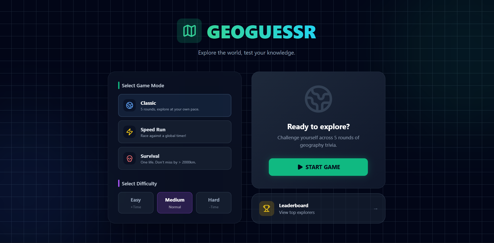
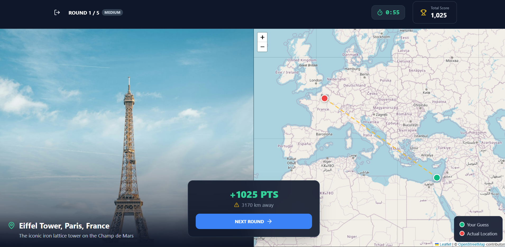
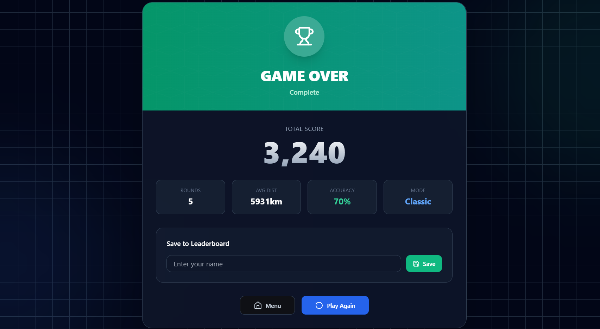
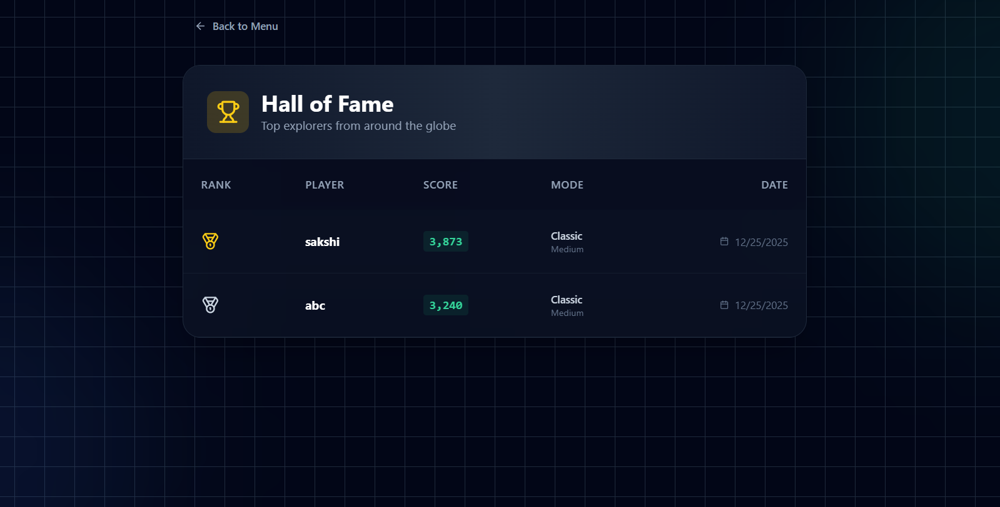

# 🌍 GeoGuessr Clone

<div align="center">


A modern, interactive geography guessing game built with React and Leaflet. Test your geographical knowledge by guessing locations from around the world!

[🎮 Play Now](https://siya186.github.io/geoguessr-clone) • [📝 Report Bug](mailto:goswamiskavi@gmail.com) • [✨ Request Feature](mailto:goswamiskavi@gmail.com)

</div>

---

##  Screenshots





##  Features

-  **Interactive Map Interface** - Powered by Leaflet for smooth map interactions
-  **Accurate Scoring System** - Points calculated based on distance from the actual location
-  **Leaderboard** - Track your best scores and compete with yourself
-  **Famous Landmarks** - Guess locations of iconic places around the world
-  **Responsive Design** - Play seamlessly on desktop, tablet, and mobile devices
-  **Beautiful UI** - Modern interface with Tailwind CSS and Framer Motion animations
-  **Fast Performance** - Built with Vite for lightning-fast development and production builds

##  How to Play

1. **Start the Game** - Click the play button to begin
2. **View Location** - You'll see an image of a location
3. **Make Your Guess** - Click on the map where you think the location is
4. **Submit** - Confirm your guess to see how close you were
5. **Score Points** - Earn points based on accuracy (max 5000 points per round)
6. **Continue** - Play through multiple rounds and try to beat your high score!

##  Quick Start

### Prerequisites

- Node.js (v18 or higher)
- npm or yarn

### Installation

1. **Clone the repository**
   ```bash
   git clone https://github.com/siya186/geoguessr-clone.git
   cd geoguessr-clone
   ```

2. **Install dependencies**
   ```bash
   npm install
   ```

3. **Start the development server**
   ```bash
   npm run dev
   ```

4. **Open your browser**
   Navigate to `http://localhost:5173`

##  Build for Production

```bash
npm run build
```

The production-ready files will be in the `dist` folder.

## 📁 Project Structure

```
geoguessr-clone/
├── public/              # Static assets
├── src/
│   ├── assets/         # Images and other assets
│   ├── components/     # React components
│   │   ├── game/       # Game-specific components
│   │   └── ui/         # Reusable UI components
│   ├── data/           # Game data (locations)
│   ├── lib/            # Utility functions
│   ├── utils/          # Game logic utilities
│   ├── App.jsx         # Main application component
│   └── main.jsx        # Application entry point
├── index.html          # HTML template
├── package.json        # Project dependencies
├── vite.config.js      # Vite configuration
└── tailwind.config.cjs # Tailwind CSS configuration
```

##  Built With

- **[React](https://react.dev/)** - A JavaScript library for building user interfaces
- **[Vite](https://vitejs.dev/)** - Next generation frontend tooling
- **[Tailwind CSS](https://tailwindcss.com/)** - A utility-first CSS framework
- **[Leaflet](https://leafletjs.com/)** - Open-source JavaScript library for interactive maps
- **[Framer Motion](https://www.framer.com/motion/)** - A production-ready motion library for React
- **[Lucide React](https://lucide.dev/)** - Beautiful & consistent icon toolkit
- **[Radix UI](https://www.radix-ui.com/)** - Unstyled, accessible components

##  Game Scoring

- **Perfect Guess (0-10 km)**: 5000 points
- **Excellent (10-50 km)**: 4000-4999 points
- **Very Good (50-100 km)**: 3000-3999 points
- **Good (100-250 km)**: 2000-2999 points
- **Fair (250-500 km)**: 1000-1999 points
- **Needs Improvement (500+ km)**: 0-999 points

## 📝 License

This project is open source and available under the [MIT License](LICENSE).

## 👨‍💻 Author

**Sakshi Goswami**

- GitHub: [siya186]

## 🙏 Acknowledgments

- Inspired by [GeoGuessr](https://www.geoguessr.com/)
- Location images from [Unsplash](https://unsplash.com/)
- Map tiles from [OpenStreetMap](https://www.openstreetmap.org/)

---

<div align="center">

Made with ❤️ and React

⭐ Star this repo if you like it!

</div>
